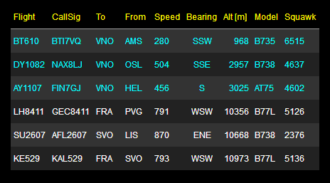
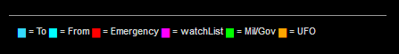

## MagicMirror Module: FlightsAbove

[](https://github.com/MichMich/MagicMirror)
[](https://inch-ci.org/github/E3V3A/MMM-FlightsAbove)
[](https://github.com/E3V3A/MMM-FlightsAbove)
[](https://GitHub.com/E3V3A/MMM-FlightsAbove/graphs/commit-activity)
[](http://isitmaintained.com/project/E3V3A/MMM-FlightsAbove "Average time to resolve an issue")

Display what is currently flying above your location


| STATUS: | Version | Date | Maintained? |
|:------- |:------- |:---- |:----------- |
| Working | `1.0.4` | 2018-03-13 | YES |


#### What is this module doing?

*MMM-FlightsAbove* is a [MagicMirror](https://github.com/MichMich/MagicMirror) module for displaying what is 
currently flying around in the airspace above some location. The *location* is defined by the *latitude* and 
*longitude* of your location, and a radius in *kilometers*, which determine the maximum distance to which you 
want to detect aircraft.

However, because maps you see and use are flat and squared, internally the application is using a 
*boundary box* (BB) to determine the area of interest. The BB sides are just the latitutes and longitudes of the map.
So to easily calculate the BB values given a geographical location, we have included a tool that does the calculation for you. 
Use this to copy/paste your BB into your configuration file. 

The flight data is provided by [FlightRadar24](https://www.flightradar24.com/), but could be easily extended 
to use other sources as well.

The specific flight data items available from the API that you can display are: 


| Data Item     | Description |
|:------------- |:----------- |
| id            | Unique F24 id |
| modes         | Mode-S Transponder code: 6-digit [hex] is a 24-bit ICAO issued code |
| latitude      | in decimal degrees |
| longitude     | in decimal degrees |
| bearing       | in [degrees] |
| altitude      | in [feet]  |
| speed         | in [knots] |
| squawk        | Mode-3/A Transponder code: 4-digit [octal] is the "Squawk" ATC assigned code |
| radar         | F24 "radar" data source (ADS-B, MLAT, RADAR (ATC feed), FLARM, "ESTIMATED") designator |
| model         | ICAO Aircraft Type Designator |
| registration  | ICAO Aircraft (tail) registration number |
| timestamp     | Timestamp [Unix/POSIX/epoch] |
| origin        | Departure Airport IATA |
| destination   | Destination Airport IATA |
| flight        | IATA Flight Id |
| ground        | Airplane is "onGround": [0/1]  |
| climb         | "Rate of Climb" (RoC) is a vertical speed [ft/m] |
| callsign      | ICAO ATC call signature |
| glider        | Aircraft is a glider:  [0/1]  (There are usually no or very few gliders registered on earth!) |


### Example Screenshots


Module Screenshot:


(From the [MMM-Tabulator](https://github.com/E3V3A/MMM-Tabulator) Demo.)

Here is a screenshot when using the config option: `homeIata: "VNO"` and `compassHeading: true` to 
highlight flights with the origin or destination airport given by the IATA code "VNO", and show the 
compass heading in text form and not in degrees. 



Using the config option `footerLegend: true` will enable a footer with the color legend.




The `MagicRadarBB.html` *Boundary Box Calculator* Screenshot:


---


### Dependencies

This module depend on the following *npm* packages:

* [jquery](https://github.com/jquery/jquery)  - is a fast, small, and feature-rich JavaScript library
* [jquery-ui](https://github.com/jquery/jquery-ui)  - for user interface interactions, effects, widgets, and themes
* [tabulator](https://github.com/olifolkerd/tabulator) - for an overkill use of JSON to HTML table generation
* [flightradar24-client](https://github.com/derhuerst/flightradar24-client/) - the API used to get FR24 flight data

These are also listed in the `package.json` file and should be installed automatically when using *npm*.
However, those may require other packages. 

### Compatibility

This module is compatible with other **remote control** modules such as:

* [Hello-Lucy](https://github.com/mykle1/Hello-Lucy) (This is a plug-in to MMM-voice.) 
* [MMM-voice](https://github.com/fewieden/MMM-voice)

Those allow you to control this module by Voice commands.
For example, in Hello-Lucy you can say: "`SHOW FLIGHTS`" or "`HIDE FLIGHTS`" to show or hide this module.


---


### Installation

Manual Installation:

```bash
cd ~/MagicMirror/modules
git clone https://github.com/E3V3A/MMM-FlightsAbove.git
cd MMM-Tabulator
```

To install the depdendencies: *jquery*, *jquery-ui* and *tabulator*, do:

```bash
npm install jquery --save
npm install jquery-ui-dist --save
npm install jquery.tabulator --save

```

To install the *flightradar24-client* (API), use:

```bash
npm install flightradar24-client
```


Alternatively, on a *unix based distribution, you can try to install all the dependencies with the Bash script:

```bash
chmod 755 install_deps.sh
./install_deps.sh
```


#### Easy Installation [**ToDo**]:

```bash
npm install mmm-flightsabove
```

---


### Configuration 

To configure the FlightsAbove, you need to do the following:

1. Add the Module to the global MM `config.js` 
2. Edit the global config to add the 4 lat/lon values for the Boundary Box of your location
3. [optional] Edit `MMM-FlightsAbove.js` Tabulator settings to:
    - select & configure the table rows you want to show
    - edit the column formatting to be used
    - select the default Tabulator CSS
4. [optional] Edit `MMM-FlightsAbove.css` for your own CSS taste


Add the module to the modules array in the `config/config.js` file by adding the following section. 

```javascript
{
    module: 'MMM-FlightsAbove',
    header: 'Flights Above',
    position: 'top_left',
    config: {
        header: "Flights Above",          // The module header text, if any. Use: "" to remove.
        compassHeading: true,             // Use a compass direction (NSWE) for the of heading indicator ("45" vs "NE")
        updateInterval: 180,              // [s] Radar scan/ping/update period in secodns [default 3 min]
        maxItems: 10,                     // MAX Number of planes to display [default is 10]
        // The geographical (map) Boundary-Box (BB), from within planes will be shown are given by:
        // the maximim Lat/Lon edges of: [N-lat, W-lon, S-lat, E-lon] - all in decimal degrees.
        radarBBox: [-8.20917,114.62177,-9.28715,115.71243], // "DPS" (Bali Airport) [default]
        //radarLocation: "23.2,54.2",     // [Lat,Lon] - The location of radar center in decimal degrees
        //radarRadius: 60,                // [km] - The maximum distance of planes shown.
        //watchList: "",                  // Alert or Highlight planes/flights/types on this watch list
    }
},
...
```

You can change this configuration later when you see that it works.

---

#### The Boundary Box Coordinates

Unfortunately, the API is operating with a geographical boundary-box (BB), rather than a sphercial radius from 
a given location. So you need to convert your locations Lat/Lon (in decimal degrees) to the 4 coordinates 
representing the sides of the BB. These are given by: `MaxLat, MinLon, MinLat, MaxLon`, or in other words, 
the `north, west, south, east` edges. 


However, I have provided a simple GoogleMap based tool that make this calculation trivial. 
Look at the picture above, to see what to expect. To use the tool the first time, do the following:

1. Have your `Google Maps API Key` handy. You can get one [HERE](https://developers.google.com/maps/documentation/javascript/get-api-key).
2. Edit the file: `./tools/MagicRadarBB.html` and replacing the text "YOUR_GOOGLE_MAPS_API_KEY" with your key.
3. Simply point your browser to one of the following URLs:
   * from a local browser, open the file: `./tools/MagicRadarBB.html` in the module directory.
   * from a local or remote browser, go to: http://192.168.xx.yy:8080/modules/MMM-FlightsAbove/tools/MagicRadarBB.html
4. Enter the *Latitude* and *Longitude* in decimal degrees, for your location.
5. Enter the *radius* in kilometer, out to which you want to see flights. 
6. [*optional*] You can also drag the central marker to any point on the map. (Use `+`/`-` to zoom in/out.)
7. Hit `Calculate` and copy the resulting coordinate text from the `FR24 BB` textbox into your MM config file.
8. If you get a blank map, your API key is probaly expired, invalid or over-used.

Eventually, we would like to calculate this automatically in the `node_helper.js` script. (See issues)


**Q: What radius should I use?**

**A:** Since there is little use in displaying planes you cannot see, what you really should be 
asking is, how far can I see an airplane? The answer obviously depend on where you are, and especially 
how high you are. If you are down in a valley surrounded by mountains, you can use your trigonometry 
skills to figure that its probably not much more than 30 km, *line of sight* (LOS). But if you are on 
top of a mountain with free horizon, we could be talking about 120 km, at which point the aircraft would 
just present itself as a tiny spot in the sky. This module is preset at a moderate 60 km LOS.

For an interesting London discussion, see [this](https://www.metabunk.org/how-far-away-can-i-see-an-aircraft.t4038/).


#### Configuration Options 


| Option            | Default          | Description  |
|:----------------- |:---------------- |:------------ | 
| header            | "Flights Above"  | This Module's header text |
| compassHeading    | true             | Use a compass direction (NSWE) for the of heading indicator ("45" vs "NE") |
| updateInterval    | 180              | Module data update rate in [seconds] |
| maxItems*         | 10               | MAX number of planes (table rows) to show |
| radarBBox         | [see text]       | The geographical boundary-box in NW-SE notation [dec.degrees] |
| radarLocation*    | [see text]       | The location of radar center in decimal degrees |
| radarRadius*      | [see text]       | The maximum distance of planes shown |
| watchList*        | [see text]       | Highlight planes/flights/types on watch list |
| speedunit*        | "kmh"            | [kmh,kn] The speed unit |
| altunit*          | "m"              | [m,ft] The Altitude unit | 
| fontsize*         | "small"          | [small,medium,large] |
| itemlist*         | [see text]       | List of items (columns) to be shown |

`*` - **not yet implemented - ToDo!**

The default table columns shown, are: `[flight,callsig,to,from,alt,speed,bearing,alt,model,squawk]`
But there are also: `[id,registration,model,modes,radar]` available. 


```diff
-▃▃▃▃▃▃▃▃▃▃▃▃▃▃▃▃▃▃▃▃▃▃▃▃▃▃▃▃▃▃▃▃▃▃▃▃▃▃▃▃▃▃▃▃▃▃▃▃▃▃▃▃▃▃▃▃▃▃▃▃▃▃▃▃▃
```

> :warning: Please do not use an **updateInterval** shorter than ~2 minutes (120 seconds). A too short 
> setting is useless as planes do not move across the visible sky that fast, and no, you will not be 
> able to see F16's or MIG's, as they are not tracked by F24. So please respect the free services 
> provided by the Flightradar24 API. You also risk getting blocked by their servers if you rapid-fire 
> requests. Finally, the services provided by them could break at any time, there are no service guarantees. :warning: 

```diff
-▃▃▃▃▃▃▃▃▃▃▃▃▃▃▃▃▃▃▃▃▃▃▃▃▃▃▃▃▃▃▃▃▃▃▃▃▃▃▃▃▃▃▃▃▃▃▃▃▃▃▃▃▃▃▃▃▃▃▃▃▃▃▃▃▃
```


#### *Tabulator* Configuration

The main part to configure is found under the `loadTabulator()` function:

```javascript
...
    flightTable.tabulator({
        height:flightTableHeight,           // [px] Set MAX height of table, this enables the Virtual DOM and improves render speed
        layout:"fitDataFill",               // Resize columns to fit thier data and ensure rows takeup the full table width
        //layout:"fitColumns",              // Resize columns so that they fit perfectly inside the width of the container
        layoutColumnsOnNewData:true,        // Adjust the column width to the data each time you load it into the table
        //headerSort:false,                 // Disable header sorter
        resizableColumns:false,             // Disable manual column resize
        responsiveLayout:true,              // Enable responsive layouts
        placeholder:"Waiting for data...",  // Display message to user on empty table
        initialSort:[                       // Define the sort order:
            {column:"altitude",     dir:"asc"},     // 1'st
            //{column:"flight",     dir:"desc"},    // 2'nd
            //{column:"bearing",    dir:"asc"},     // 3'rd
        ],
        columns:[
            ...
            {title:"Time", field:"timestamp", headerSort:false, sortable:false, visible:false, responsive:1, formatter:"ep2time"},
...

```

For further details about configuring the many Tabulator options, see [MMM-Tabulator](https://github.com/E3V3A/MMM-Tabulator/) and references therein.


---

#### Bugs and Warnings

:information_source: The data provided by the *flightradar24-client*, is not JSON, even if it resembles it. It is 
actually an *Array of JavaScript objects*. For an example of the raw data, look at the `demo.json` file.

For other bugs, issues, details and updates, please refer to the [issue tracker](https://github.com/E3V3A/MMM-FlightsAbove/issues).


#### Contribution

Feel free to post issues and PR's related to this module.  
For all other or general questions, please refer to the [MagicMirror Forum](https://forum.magicmirror.builders/).

#### Credits 

Most grateful thanks to:
* [raywo](https://github.com/raywo/) - for clarifying and fixing the API response mechanism 
* [tbbear](https://github.com/tbbear/) - for helping and clarifying JS Promises
* [fewieden](https://github.com/fewieden) - for helping out in forums and fixing issues


#### License 

[](https://github.com/E3V3A/MMM-FlightsAbove/blob/master/LICENSE) 

(MIT)
