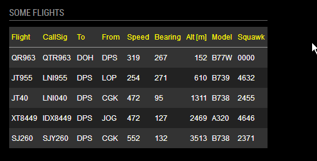

## MagicMirror Module: FlightsAbove

| STATUS: | Version | Date | Maintained? |
|:------- |:------- |:---- |:----------- |
| Working | `1.0.1` | 2018-02-28 | YES |


#### What is this module doing?

'MMM-FlightsAbove' is a module for displaying what is currently flying around in the airspace above some location.
The *location* is defined by a boundary box (BB) whose sides are determined by the a radial distance (R) from 
a central point (the radar) given by the *latitude* and *longitude*. The radius is in *kilometers*. To easily 
calculate the BB given a geograpthical location, we have included a tool that does the calculation for you. 

The flight data is provided by [FlightRadar24](https://www.flightradar24.com/), but could be easily extended 
to use other sources as well.

The specific flight data items available for display are: 


| Data Item     | Description |
|:------------- |:----------- |
| id            | Unique F24 id ? |
| modeS         | Mode-S Transponder code: 6-digit [hex] is a 24-bit ICAO issued code |
| latitude      | in decimal degrees |
| longitude     | in decimal degrees |
| bearing       | in [degrees] |
| altitude      | in [feet]  |
| speed         | in [knots] |
| squawk        | Mode-3/A Transponder code: 4-digit [octal] is the "Squawk" ATC assigned code |
| radar         | F24 "radar" data source (ADS-B, MLAT, RADAR (ATC feed), FLARM, "ESTIMATED") designator |
| model         | ICAO Aircraft Type Designator |
| registration  | ICAO Aircraft (tail) registration number |
| timestamp     | Timestamp [Unix/POSIX/epoch] |
| origin        | Departure Airport IATA |
| destination   | Destination Airport IATA |
| flight        | IATA Flight Id |
| ground        | Airplane is "onGround": [0/1]  |
| climb         | "Rate of Climb" (RoC) is a vertical speed [ft/m] |
| callsign      | ICAO ATC call signature |
| glider        | Aircraft is a glider:  [0/1]  (There are usually no or very few gliders registered on earth!) |


### Example Screenshots


Module Screenshot:



(From the [MMM-Tabulator](https://github.com/E3V3A/MMM-Tabulator) Demo.)

The `MagicRadarBB.html` *Boundary Box Calculator* Screenshot:


---


### Dependencies

This module depend on the following *npm* packages:

* [jquery](https://github.com/jquery/jquery)  - is a fast, small, and feature-rich JavaScript library
* [jquery-ui](https://github.com/jquery/jquery-ui)  - for user interface interactions, effects, widgets, and themes
* [tabulator](https://github.com/olifolkerd/tabulator) - for an overkill use of JSON to HTML table generation
* [flightradar24-client](https://github.com/derhuerst/flightradar24-client/) - the API used to get FR24 flight data

These are also listed in the `package.json` file and should be installed automatically when using *npm*.
However, those may require other packages. 

---


### Installation

Manual Installation:

```bash
cd ~/MagicMirror/modules
git clone https://github.com/E3V3A/MMM-FlightsAbove.git
cd MMM-Tabulator
```

To install the depdendencies: *jquery*, *jquery-ui* and *tabulator*, do:

```bash
npm install jquery --save
npm install jquery-ui-dist --save
npm install jquery.tabulator --save

```

To install the *flightradar24-client* (API), use:

```bash
npm install flightradar24-client
```


Alternatively, on a *unix based distribution, you can try to install all the dependencies with the Bash script:

```bash
chmod 755 install_deps.sh
./install_deps.sh
```


#### Easy Installation [**ToDo**]:

```bash
npm install mmm-flightsabove
```

---


### Configuration 

To configure the FlightsAbove, you need to do the following:

1. Add the Module to the global MM `config.js` 
2. Edit the global config to add the 4 lat/lon values for the Boundary Box of your location
3. [optional] Edit `MMM-FlightsAbove.js` Tabulator settings to:
    - select & configure the table rows you want to show
    - edit the column formatting to be used
    - select the default Tabulator CSS
4. [optional] Edit `MMM-FlightsAbove.css` for your own CSS taste


Add the module to the modules array in the `config/config.js` file by adding the following section. 

```javascript
{
    module: 'MMM-FlightsAbove',
    header: 'Flights Above',
    position: 'top_left',
    config: {
        //header: "Flights Above",        // The module header text, if any. (Use: "" to remove.)
        //headingIndicator: "decimal",    // ["decimal", "compass"] Type of heading indicator (I.e. "45" vs "NE")
        updateInterval: 10000,          // [ms] 3*60*1000 // Radar scan/ping/update period [default 3 min]
        //maxItems: 10,                   // MAX Number of planes to display [default is 10]
        // The geographical (map) Boundary-Box (BB), from within planes will be shown are given by:
        // the maximim Lat/Lon edges of: [N-lat, W-lon, S-lat, E-lon] - all in decimal degrees.
        //radarBBox: "-8.20917,114.62177,-9.28715,115.71243", // "DPS" (Bali Airport) [default]
        //radarLocation: "23.2,54.2",     // [Lat,Lon] - The location of radar center in decimal degrees
        //radarRadius: 60,                // [km] - The maximum distance of planes shown.
        //watchList: "",                   // Highlight planes/flights/types on watch list
    }
},
...
```

You can change this configuration later when you see that it works.

#### The Boundary Box Coordinates

Unfortunately, the API is operating with a geographical boundary-box (BB), rather than a sphercial radius from 
a given location. So you need to convert your locations Lat/Lon (in decimal degrees) to the 4 coordinates 
representing the sides of the BB. These are given by: `Max Lat, Min Lon, Min Lat, Max Lon`, or in other words:
`north, west, south, east` edges.

However, I have made a simple GoogleMap based tool that make this calculation trivial. Just enter your
radar center Lat/Lon and the radius. Hit calculate and copy/paste the resulting FR24 BB coordinates into 
the MM config file. Simply point your browser to the file: `./tools/MagicRadarBB.html`. However, you will 
need to get and enter [your own Google Maps API key](https://developers.google.com/maps/documentation/javascript/get-api-key) in that file.

Eventually, we would like to calculate this automatically in the `node_helper.js` script. (See issues)


**Q: What radius should I use?**

**A:** Since there is little use in displaying planes you cannot see, what you really should be 
asking is, how far can I see an airplane? The answer abviously depend on where you are, and especially 
how high you are. If you are down in a velley surrounded by mountains, you can use your trigonometry 
skills to figure that its probably not much more than 30 km, line of sight (LOS). But if you are on top of
a mountain with free horizon, we could be talking about 120 km, at which point the aircraft would just
present itself as a tiny spot in the sky. This module is preset at a moderate 60 km LOS.

For an interesting London discussion, see [this](https://www.metabunk.org/how-far-away-can-i-see-an-aircraft.t4038/).


#### Configuration Options 

`WIP`


| Option            | Default          | Description  |
|:----------------- |:---------------- |:------------ | 
| header            | "Flights Above"  | This Module's header text |
| headingIndicator  | "decimal"        | ["decimal", "compass"] Type of heading indicator (I.e. "45" vs "NE") |
| updateInterval    | `5*60*1000`      | Module data update rate in [ms] |
| maxItems*         | 10               | MAX number of planes (table rows) to show |
| radarBBox*        | [see text]       | The geographical (map) boundary-box (BB) |
| radarLocation*    | [see text]       | The location of radar center in decimal degrees |
| radarRadius*      | [see text]       | The maximum distance of planes shown |
| watchList*        | []               | Highlight planes/flights/types on watch list |

`*` - **not yet implemented - ToDo!**

---

:warning: 

> Please do not use an `updateInterval` shorter than ~2 minutes (120,000 [ms]). A too short setting
> is useless as planes do not move across the visible sky that fast, and no, you will not be able 
> to see F16's or MIG's. They are not tracked by F24. So please respect the free services provided 
> by the Flightradar24 API. You also risk getting blocked by their servers if you rapid fire requests.
> Finally, the services provided by them could break at any time, there are no service guarantees.  

:warning: 

---

#### `Tabulator` configuration

The main part to configure is found under the `loadTabulator()` function:

```javascript
...
    flightTable.tabulator({
        height:205,                         // Set height of table, this enables the Virtual DOM and improves render speed
        //layout:"fitColumns",                // Fit columns to width of table (optional)
        //headerSort:false,                   // Disable header sorter
        resizableColumns:false,             // Disable column resize
        responsiveLayout:true,              // Enable responsive layouts
        placeholder:"No Data Available",    // Display message to user on empty table
        initialSort:[                       // Define the sort order:
            {column:"altitude",     dir:"asc"},     // 1'st
            //{column:"flight",     dir:"desc"},    // 2'nd
            //{column:"bearing",    dir:"asc"},     // 3'rd
        ],
        columns:[
            ...
            {title:"Time", field:"timestamp", headerSort:false, sortable:false, visible:false, responsive:1, formatter:"ep2time"},
...

```

For further details about configuring the many Tabulator options, see [MMM-Tabulator](https://github.com/E3V3A/MMM-FlightsAbove/issues) and references therein.


---

#### Bugs and Warnings

:information_source: The data provided by the *flightradar24-client*, is not JSON, even if it resembles it. It is 
actually an *Array of JavaScript objects*. For an example of the raw data, look at the `demo.json` file.

For other bugs, issues, details and updates, please refer to the [issue tracker](https://github.com/E3V3A/MMM-Tabulator/issues).


#### Contribution

Feel free to post issues and PR's related to this module.  
For all other or general questions, please refer to the [MagicMirror Forum](https://forum.magicmirror.builders/).

#### Credits 

Most grateful thanks to:
* [raywo](https://github.com/raywo/) - for clarifying and fixing the API response mechanism 
* [tbbear](https://github.com/tbbear/) - for helping and clarifying JS Promises


#### License 

MIT 
